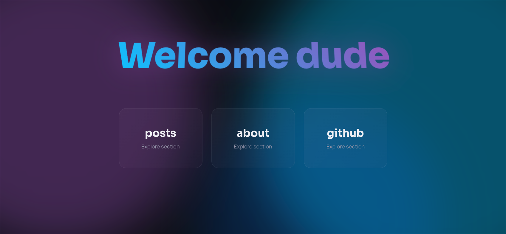

# Prism
A modern Zola theme featuring glassmorphism design and aurora-inspired animations.



## Features

- 🎨 Glassmorphic UI elements with backdrop blur
- ✨ Aurora blob animations with gradient overlays
- 🌙 Dark theme with neon accents
- 📱 Fully responsive design
- ⚡ Fast and lightweight

## Installation

Clone the theme into your `themes` directory:
```bash
git clone https://github.com/jahongir7174/zola-prism.git themes/prism
```

Enable the theme in your `config.toml`:
```toml
theme = "prism"
```

## Configuration

See [config.toml](config.toml) for all available options.

## License

AGPL-3.0
